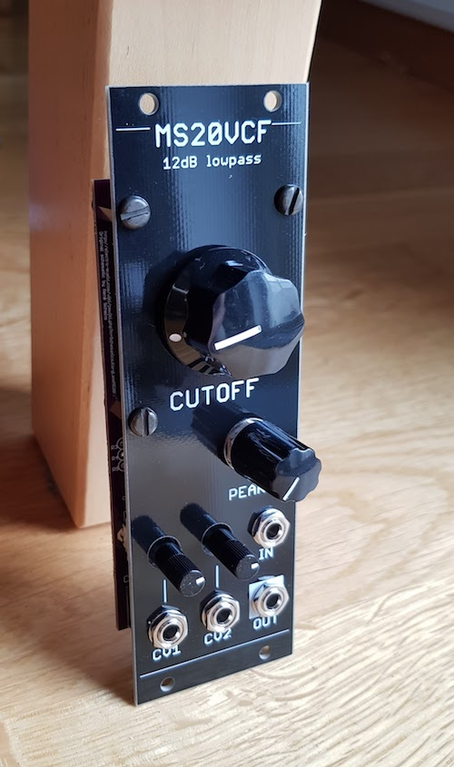

## MS20 VCF module

This Eurorack module is base on this schematic:
[http://electro-music.com/wiki/pmwiki.php?n=Schematics.KorgLateMS20Filter](http://electro-music.com/wiki/pmwiki.php?n=Schematics.KorgLateMS20Filter)

After breadboarding the circuit I decided to create a eurorack module out of it. 
There are a few component value changes compared to the original but most of it is identical. 

The filter has a very wide frequency range and can be used as a lowpass gate. It also self-oscillates.

The filter can also be used to create synth drum type sounds if used with an envelope generator connected to a CV input and the peak/resonance control turned up. 

This is also the first time I used a circuit board for the panel (manufactured at PCBWay.com). I'm very pleased with the result. :) 

Schematic, PCB and panel licensed [CC BY-SA](https://creativecommons.org/licenses/by-sa/4.0/) 

* note: the panel .svg file for laser cutting has not been verified to be correct. 
