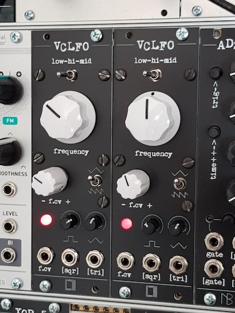
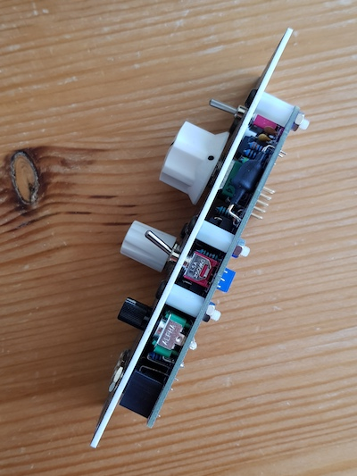

## VCLFO

An 8HP wide LFO/VCO module with voltage control over frequency. 

- Three frequency ranges, can go from minute long periods up to full audio range
- CV frequency control with attenuverter, adjusts CV sensitivity and polarity
- large CV range, can sweep from a few herz up to (almost) ultrasound. With extreme settings this can also be used as a freeze/run control.
- exponential CV response
- separate triangle/ramp and square wave outputs, each with level adjustment
- switch for ramp or triangle output (also transforms the square output into a pulse output)

 

. . . . .

