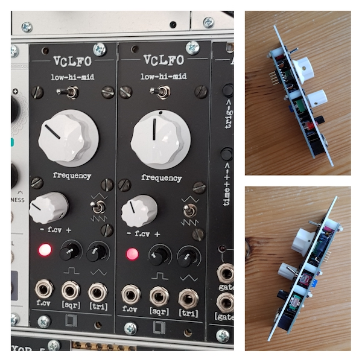

## VCLFO

[https://github.com/L71/VCLFO](https://github.com/L71/VCLFO)

An 8HP wide LFO/VCO module with voltage control over frequency. 

- Three frequency ranges, can go from minute long periods up to full audio range
- CV frequency control with attenuverter, adjusts CV sensitivity and polarity
- large CV range, can sweep from a few herz up to (almost) ultrasound. With extreme settings this can also be used as a freeze/run control.
- exponential CV response, does not really track 1V/oct in any setting though.
- separate triangle/ramp and square wave outputs, each with level adjustment
- switch for ramp or triangle output (also transforms the square output into a pulse output)

The circuit is based on a vactrol (LED + photoresistor) to control the frequency of the oscillator. Because of this the frequency control is notvery precise, it will have a response time of a few milliseconds to quick changes in control voltage and the frequency will also drift very slightly even after the LED brightness has been set by a change in the control voltage. 

This module was originally built to provide an additional modulation source for my Arturia Microbrute. It turned out to be more useful than expected so a few more have been built :)  

Schematic, PCB and panel licensed [CC BY-SA](https://creativecommons.org/licenses/by-sa/4.0/) 

